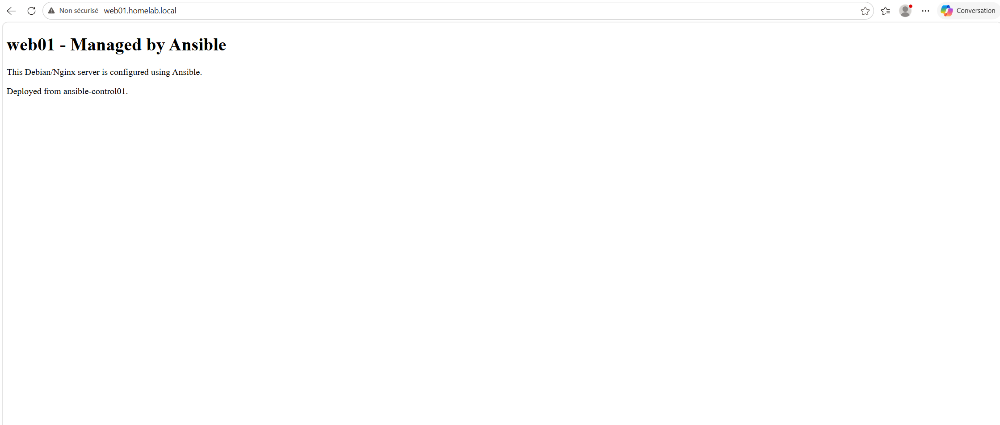

# Backup & Recovery Homelab

A practical backup and recovery lab built on Proxmox VE.

This project demonstrates how to back up a virtual machine, restore it into a separate test VM, and validate that the restored service works correctly.

## Lab Overview

The lab uses an existing Proxmox VE homelab with segmented networks managed by OPNsense.

The recovery test was performed on a Debian/Nginx web server located in the DMZ network.

Main systems:

| VM ID | Hostname | IP address | Role |
|---|---|---|---|
| 330 | web01 | 10.10.30.10 | Original Debian/Nginx web server |
| 331 | web01-restore-test | 10.10.30.10 | Restored test VM |
| 310 | win11-client-lab | 10.10.10.105 | Client used for validation |

## Goal

The goal of this project is to prove that a backup is not only created, but also restorable and usable.

A backup is only valuable if it can be restored successfully.

## Backup Method

The backup was created with Proxmox `vzdump`.

Backup command used:

    vzdump 330 --storage backup-nvme --mode snapshot --compress zstd --notes-template "Backup and recovery lab - web01 baseline before restore test"

Backup storage:

    backup-nvme

Backup file:

    /mnt/backup-nvme/dump/vzdump-qemu-330-2026_06_06-20_42_56.vma.zst

Compressed backup size:

    745 MB

## Restore Method

The backup was restored into a new VM ID to avoid overwriting the original VM.

Restore target:

| VM ID | Name |
|---|---|
| 331 | web01-restore-test |

Restore command used:

    qmrestore /mnt/backup-nvme/dump/vzdump-qemu-330-2026_06_06-20_42_56.vma.zst 331 --storage fast-nvme --unique 1

The original VM 330 was shut down during the restore validation to avoid an IP conflict, because the restored VM used the same static IP address:

    10.10.30.10

## Validation

After restore, the following checks were performed:

- Restored VM started successfully
- QEMU Guest Agent returned the expected network interface
- Restored VM received IP address 10.10.30.10
- Nginx web page was accessible from the Windows 11 client
- Original VM 330 was restarted after the test
- Original web01 service was validated again

Validation URL:

    http://web01.homelab.local

Expected page:

    web01 - Managed by Ansible

## Screenshots

### Backup file and restored VM validation

### Nginx service after restore

## Lessons Learned

This project helped validate practical backup and recovery skills:

- Creating a Proxmox VM backup with `vzdump`
- Choosing a proper backup storage target
- Restoring a backup into a separate test VM
- Avoiding IP conflicts during restore validation
- Validating the restored operating system and network configuration
- Validating the application service after restore
- Understanding that backups must be tested, not only created

## Status

Project status: Completed and validated.

Validation summary:

- Backup created successfully
- Restore completed successfully
- Restored VM booted successfully
- Nginx service validated successfully
- Original VM restored to normal operation
